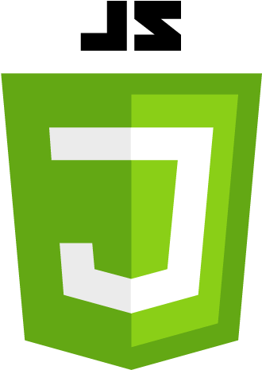
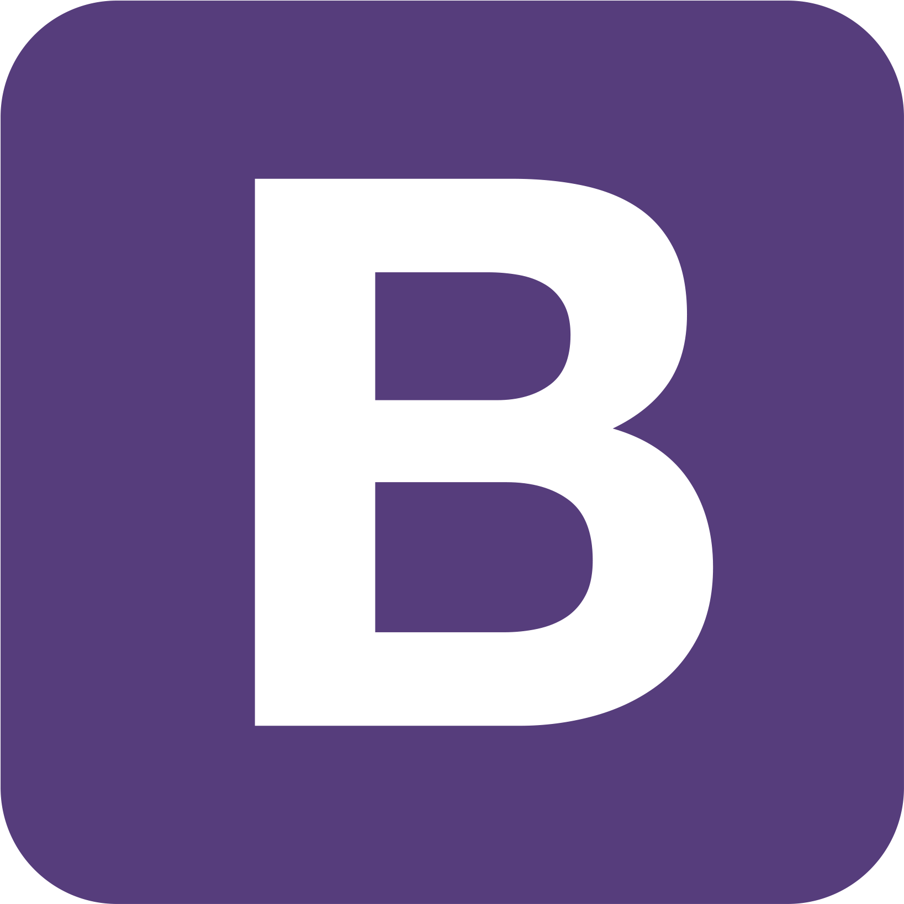
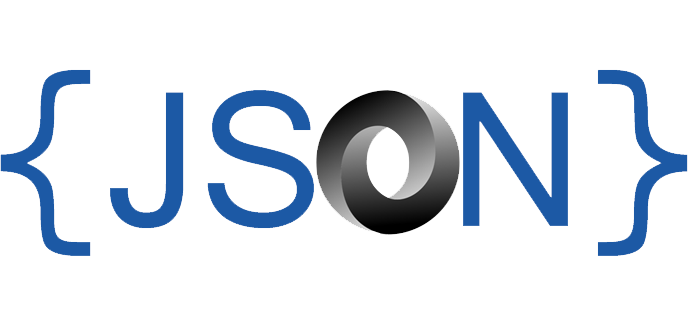

### Hi there 👋
<h2> नमस्ते, All <coders/>! </h2>

Hi, My name is Aaditya Prakash. I have a keen interest in Machine Learning and Web Development and also took part in many All India Hackathons.
I am very dedicated to my work and passionate about implementing and launching new ideas. Fast learner and adaptable to different project environments.
My work will be full of unique creativity and style .

### Programming Languages  :rocket:
| |  |  |  |  |  |
|:---:|:---:|:---:|:---:|:---:|:---:|

### Tools :fire:
| |   |  | |
|:---:|:---:|:---:|:---:|

### CP Profile :fire:
#### Codeforces
#### 

#### Codechef
#### 

### Github Stats  :rocket:

- 📫 How to reach me : (DO Follow the emoticon )✊
- 💬 Ask me about anything an everything.
- 📫 LinkedIn profile: [Aaditya Prakash](https://www.linkedin.com/in/aaditya-prakash-36650b18b/)
- 🎯 Myself in a web View: [My Portfolio](https://aadityaprakash.netlify.app/)
- 🔔 Instagram:- [prak_aaditya](https://www.instagram.com/prak_aaditya/)
- 🌀 Twitter:-   [Aaditya Prakash](https://twitter.com/Aaditya99086923)

